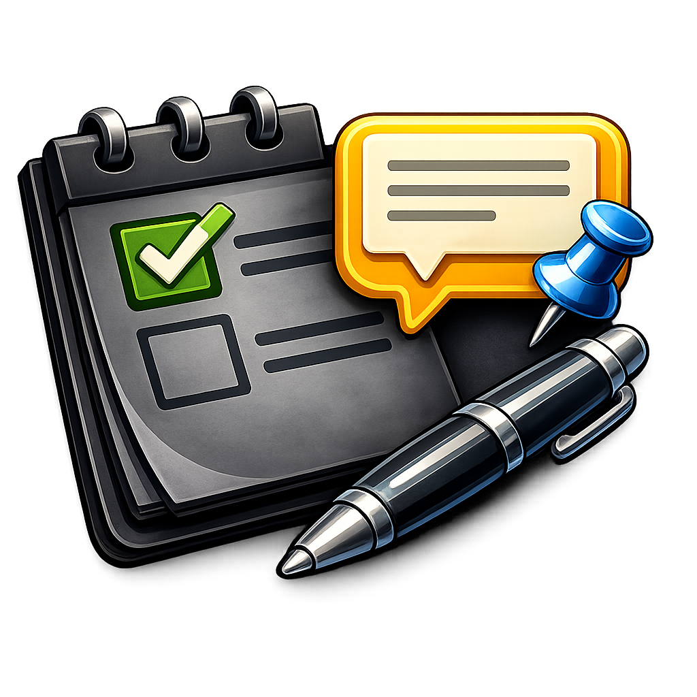
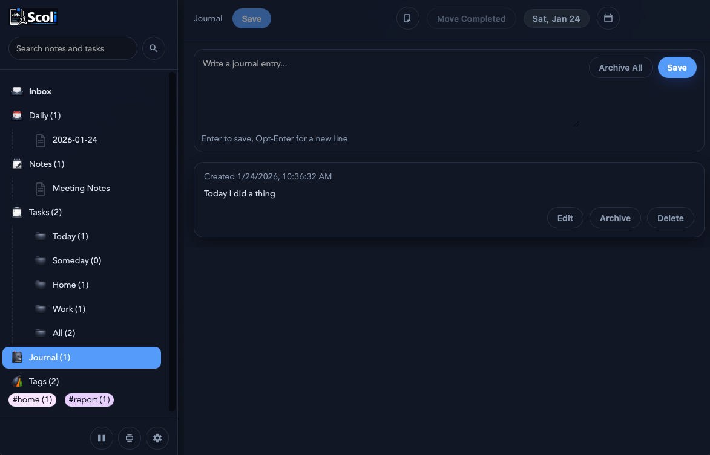

<p align="center"> 
  
</p>

<h1 align="center">Scoli</h1>

<p align="center">Local-first Markdown notes with a JSON API and a fast web UI.</p>

<p align="center">
  <a href="LICENSE">License</a>
  ·
  <a href="docs/API.md">API</a>
  ·
  <a href="#quick-start">Quick Start</a>
</p>

<p align="center">
  
</p>

## Features

- Local notes stored as plain `.md` files
- Fast tree navigation, split view editing, and live preview
- Tags, mentions, and task parsing with project, mention, due date, and priority markers
- Daily notes support with date picker and templates
- Sheets with `.jsh` storage and CSV import/export
- Global scratch pad modal stored as `scratch.md` (hidden from the tree)
- Journal feed stored in `journal/journal.json` with inline edit, delete, and archive
- Command palette with built-in actions and optional external commands file
- JSON API for all note and folder mutations
- Zero database dependency; the filesystem is the source of truth

## Why Scoli

Scoli is built for people who want their notes to live on disk, be readable
with any editor, and still have a modern web UI. It keeps operations simple:
create a file, edit the file, and the app reflects it immediately.

## Quick Start

```bash
go run ./cmd/scoli serve --notes-dir ./Notes --port 8080
```

Open http://localhost:8080.

## Keyboard shortcuts

Use Ctrl+Alt (Windows/Linux) or Ctrl+Option (macOS):

- Ctrl+Alt+S: Save
- Ctrl+Alt+E: Edit view
- Ctrl+Alt+V: Preview view
- Ctrl+Alt+B: Split view
- Ctrl+Alt+D: Open today's daily note
- Ctrl+Alt+C: Open date picker
- Ctrl+Alt+P: Open scratch pad
- Ctrl+Alt+J: Open journal
- Ctrl+Alt+K: Open command palette
- Ctrl+Alt+I: Open inbox

## Command palette

Press Ctrl+Alt+K (Ctrl+Option+K on macOS) to open the command palette. Use `>`
to search notes by filename or content (example: `> meeting notes`).

You can extend commands by setting `externalCommandsPath` in `Notes/settings.json`
to a JSON file relative to the notes directory, for example `commands.json`:

```json
[
  {
    "label": "Open Scratch",
    "keywords": ["scratch"],
    "action": "open-note",
    "args": { "path": "scratch.md" }
  }
]
```

## UI Authentication

If you expose the web UI publicly, set a password to gate the UI routes:

```bash
export NOLDERMD_UI_PASSWORD="your-password"
export NOLDERMD_UI_COOKIE_SECRET="replace-with-a-long-random-string"
```

When `NOLDERMD_UI_PASSWORD` is set, the UI is protected by a login page and a
signed session cookie. If `NOLDERMD_UI_COOKIE_SECRET` is omitted, sessions are
still signed but will reset on server restart.

## Install

### From source

```bash
go build ./cmd/scoli
./scoli serve --notes-dir ./Notes --port 8080
```

### Docker Hub (prebuilt)

```bash
docker run --rm -p 8080:8080 sottey/scoli:<version>
```

```yaml
services:
  scoli:
    image: sottey/scoli:<version>
    ports:
      - 8083:8080
    user: "1000:1000"
    volumes:
      - /path/to/notes/folder:/notes
networks: {}
```

The image includes a Tutorial folder. If you mount an empty `/notes` volume,
Scoli will copy the tutorial notes into it on first start.

Example with a local notes folder:

```bash
docker run --rm -p 8080:8080 -v "$HOME/scoli-notes":/notes sottey/scoli:0.1.2
```

Note for Colima on macOS: prefer a path under your home directory (for example,
`$HOME/scoli-notes`). Colima does not share `/tmp` by default, which can lead
to permission errors when the container tries to seed notes.

### Docker (local build)

```bash
docker build -t scoli:local .
```

```yaml
services:
  scoli:
    image: scoli:local
    ports:
      - 8083:8080
    user: "1000:1000"
    volumes:
      - /path/to/notes/folder:/notes
networks: {}
```

The `user` entry keeps file ownership aligned with your host user so the app can
create notes and templates inside the mounted `/notes` folder.

## PWA (Installable Web App)

Scoli ships as an installable PWA. This gives you a dockable window, offline
UI shell, and app shortcuts in supporting browsers.

### Install

- Open `http://localhost:8080` in a Chromium-based browser or Orion.
- Use the browser menu: "Install This Site As An App" / "Install App".

### App shortcuts

Installed apps expose shortcuts for:

- Inbox (`/?shortcut=inbox`)
- Daily note (`/?shortcut=daily`)
- Tasks (`/?shortcut=tasks`)

### Offline behavior

The UI shell is cached for offline launch. If the API server is unavailable,
you will see an offline screen with a Retry button.

### Updates

When a new build is available, an update banner and toast appear. Reload to
apply the update.

## MCP Server

The MCP server lives in `mcp/` and exposes the Scoli API as MCP tools and
resources (stdio transport).

```bash
cd mcp
go run ./cmd/scoli-mcp --api-base-url http://127.0.0.1:8080/api/v1
```

To run over HTTP:

```bash
cd mcp
go run ./cmd/scoli-mcp --api-base-url http://127.0.0.1:8080/api/v1 --transport http --listen 0.0.0.0:8090
```

## Docker Compose (Scoli + MCP)

There is a separate compose file that runs Scoli and the MCP server together:

```bash
docker compose -f mcp/compose.yml up --build
```

## Core Concepts

### Notes

- Notes are `.md` files under your notes directory.
- New note creation appends `.md` if missing.
- Files beginning with `._` are ignored.

### Tasks

Tasks are parsed on the fly from note contents. A task line looks like:

```
- [ ] Call Mom +Home #family @alice >2025-01-31 ^2
```

Markers:

- `#tag` tags (case-insensitive)
- `+project` single project (first match wins)
- `@mention` mention
- `>due` due date (multiple formats supported)
- `^priority` priority 1-5

Special tag:

- `#someday` removes a task from Today and surfaces it under Someday

### Tags

Tags are shown in the sidebar and in the note preview bar for quick navigation.

### Templates

If a folder contains `default.template`, new notes created in that folder start
with that content. Templates support date/time placeholders and simple
conditionals based on the note name.

Placeholders:

- `{{date:YYYY-MM-DD}}`, `{{time:HH:mm}}`, `{{datetime:YYYY-MM-DD HH:mm}}`
- `{{day:ddd}}` or `{{day:dddd}}`, `{{month:YYYY-MM}}`, `{{year:YYYY}}`
- `{{title}}`, `{{path}}`, `{{folder}}`

Conditionals:

```
{{if:day=sat}}
- [ ] Saturday review
{{endif}}
```

## UI Behavior

- Split view (edit/preview) with a draggable divider
- Tag pills in the preview bar open filtered tag views
- Tasks view includes Today, Someday, Task Filters, project groups, No Project, Completed, and All
- Task Filters are stored in `Notes/task-sets.json` and selectable from the Task Filters view
- Daily notes open from the header date pill or the date picker
- Daily notes show a read-only journal panel with links to edit entries in Journal
- Notes auto-save shortly after changes (debounced)

## Settings

Settings live in `Notes/settings.json` (or the mounted notes directory). Key
fields:

- `darkMode` (bool)
- `defaultView` (`edit`, `preview`, `split`)
- `sidebarWidth`
- `defaultFolder`
- `showTemplates`
- `rootIcons` (map of root node keys to icon paths)

## API

The app exposes a JSON API under `/api/v1` for notes, folders, tasks, tags, and
settings. Deep dive docs live at `docs/API.md`.

## Contributing

Issues and pull requests are welcome. If you are changing behavior, include a
clear description and a minimal reproduction.

## License

See `LICENSE`.
